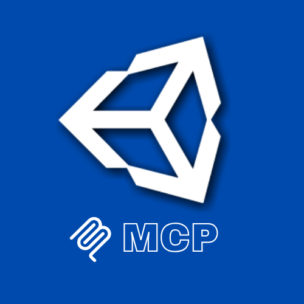

[//]: # (Constants)
[license-link]: ../../blob/main/LICENSE
[stars-link]: ../../stargazers
[issues-link]: ../../issues
[discord-link]: https://discord.gg/5skXfKRytR
[website-link]: https://spark-games.co.uk
[coffee-link]: https://buymeacoffee.com/spark88
[release-link]: ../../releases
[fork-link]: ../../fork
[privacy-link]: ./PRIVACY.md
[vid-link]: https://www.youtube.com/shorts/CCbY_ETwFss

# Unity MCP

<div align="center">

**🎮 Control Unity Editor • ⚡ Real-time automation • 🚀 AI-powered workflows**


[](https://www.npmjs.com/package/@spark-apps/unity-mcp)
[](https://www.npmjs.com/settings/spark-apps/packages)
[][license-link]
[](https://github.com/sponsors/muammar-yacoob)
[][discord-link]
[][stars-link]



</div>

## ✨ What It Does

Unity MCP provides **real-time control** of Unity Editor through the Model Context Protocol, allowing you to:

| <div align="left">Feature</div> | <div align="left">Description</div> |
|:---------|:-------------|
|  | Select, move, rotate, and scale objects with natural language |
|  | Align, distribute, duplicate objects with undo support |
|  | Enter play mode and run test scenarios programmatically |
|  | Load, save, inspect scene hierarchy in real-time |


## 🚀 Quick Setup

### 📋 Prerequisites

<details>
<summary><strong>🔑 Requirements</strong></summary>

- **Node.js** >= 18.0.0 - [Download](https://nodejs.org/)
- **Unity** 2022.3 LTS or later - [Download](https://unity.com/)
- **Claude Desktop** or any MCP client - [Download](https://claude.ai/download)

</details>

---

## 📥 Installation

> **⚠️ REQUIRED:** You must install Unity MCP before using any of its tools.

<details>
<summary><strong>📦 Choose your setup method</strong></summary>

### Method 1: Automatic Setup (Recommended) ⚡

**One command does everything:**
```bash
claude mcp add @spark-apps/unity-mcp
```
✅ Installs the package
✅ Configures your MCP client automatically
✅ Ready to use immediately after restart

---

### Method 2: Manual Setup 🛠️

**If you prefer to configure manually or use a different MCP client:**

**Step 1: Install the package globally**
```bash
npm i -g @spark-apps/unity-mcp
```

**Step 2: Add to your MCP client configuration**

Edit your MCP client config file:
- <span style="background: #1e90ff; color: white; padding: 2px 6px; border-radius: 3px; font-size: 11px; font-weight: bold;">Windows</span> `%APPDATA%\\Claude\\claude_desktop_config.json`
- <span style="background: #c0c0c0; color: black; padding: 2px 6px; border-radius: 3px; font-size: 11px; font-weight: bold;">macOS</span> `~/Library/Application Support/Claude/claude_desktop_config.json`
- <span style="background: #ffd700; color: black; padding: 2px 6px; border-radius: 3px; font-size: 11px; font-weight: bold;">Linux</span> `~/.config/Claude/claude_desktop_config.json`

Add this configuration:
```json
{
  "mcpServers": {
    "unity-mcp": {"command": "npx", "args": ["-y", "@spark-apps/unity-mcp"]}
  }
}
```

**Step 3: Restart your MCP client**

</details>

---

## 🎮 Unity Editor Integration

<details>
<summary><strong>⚡ Required one-time setup per Unity project</strong></summary>

**Why is this needed?**
Unity MCP installs C# editor scripts into your Unity project that create an HTTP server on port 8080. The MCP tools communicate with Unity through this server.

**Setup Steps:**
1. Open your MCP client (e.g., Claude Desktop or Claude Code)
2. Tell Claude:
   ```
   Setup Unity MCP in my project at /path/to/unity/project
   ```
3. This installs 4 C# scripts to `Assets/Editor/UnityMCP/`:
   - `MCPEditorServer.cs` - HTTP server
   - `EditorCommandHandler.cs` - Command processor with undo support
   - `PlayModeHandler.cs` - Play mode automation
   - `SceneHandler.cs` - Scene operations
4. Restart Unity Editor
5. Verify in Console: `[Unity MCP] Server started on port 8080`

**Done!** The MCP tools can now control Unity Editor via HTTP.

</details>

---

## 🛠️ Available Tools

<details>
<summary><strong>🔧 View All Available Tools (19 tools)</strong></summary>

**Safe Operations (Read-only)**
| <div align="left">Tool</div> | <div align="left">Description</div> |
|:------|:-------------|
|  | Install editor integration into Unity project |
|  | Select by name, tag, or pattern with framing |
|  | Find by component type or pattern |
|  | List all scenes in build settings |
|  | Get complete scene hierarchy |
|  | Find objects in current scene |
|  | Get play mode status and logs |

**Modifications (With Undo Support)**
| <div align="left">Tool</div> | <div align="left">Description</div> |
|:------|:-------------|
|  | Move, rotate, scale objects |
|  | Align left/right/top/bottom/center |
|  | Distribute evenly along axis |
|  | Clone objects with undo support |
|  | Start play mode programmatically |
|  | Exit play mode programmatically |
|  | Execute automated test scenarios |
|  | Slow motion or fast forward |
|  | Load scene by name or index |
|  | Save current or all scenes |

**Destructive Operations (Use with Caution)**
| <div align="left">Tool</div> | <div align="left">Description</div> |
|:------|:-------------|
|  | Delete objects with undo support |
|  | Remove missing scripts and empty objects |

</details>

---

## 💬 Example Commands

<details>
<summary><strong>🎯 Object Manipulation</strong></summary>

- *"Select all objects with tag 'Enemy' and align them horizontally"*
- *"Move the Player object to position (0, 5, 10)"*
- *"Distribute selected objects evenly along the x axis"*
- *"Find all objects with Camera component"*
- *"Duplicate selected object 5 times"*

</details>

<details>
<summary><strong>🧪 Automated Testing</strong></summary>

- *"Enter play mode and move Player to (10, 0, 0) for 5 seconds"*
- *"Set time scale to 0.5 for slow motion"*
- *"Run a test that destroys the Boss after 2 seconds"*
- *"Check play mode status and show test logs"*

</details>

<details>
<summary><strong>🗺️ Scene Operations</strong></summary>

- *"List all scenes in the project"*
- *"Load the MainMenu scene"*
- *"Show me the complete hierarchy of the current scene"*
- *"Find all objects with Rigidbody component"*
- *"Clean up scene by removing missing scripts"*

</details>

---

## 🐛 Troubleshooting

<details>
<summary><strong>❌ Common Issues</strong></summary>

**MCP Server Not Showing:**
1. Verify Node.js is installed: `node --version`
2. Check config file path is correct
3. Ensure JSON syntax is valid
4. Restart MCP client completely

**Unity Editor Not Responding:**
1. Ensure Unity Editor is open
2. Check `Assets/Editor/UnityMCP/` scripts are installed
3. Verify Console for `[Unity MCP] Server started on port 8080`
4. Check no errors in Unity Console

**Port Already in Use:**
1. Default port is `8080`
2. Check what's using it: `lsof -i :8080` (Mac/Linux) or `netstat -ano | findstr :8080` (Windows)
3. Stop conflicting process or change port in Unity scripts

</details>

---

## 🌱 Support & Contributions

⭐ **Star the repo** & I power up like Mario 🍄  
☕ **Devs run on coffee** - [Buy me one?][coffee-link]  
💰 **Crypto tips welcome** - [Tip in crypto](https://tip.md/muammar-yacoob)  
🤝 **Contributions are welcome** - [🍴 Fork][fork-link], improve, PR!  
🎥 **Need help?**  [Setup Tutorial][vid-link] •  [Join Discord][discord-link]

## 💖 Sponsor
Your support helps maintain and improve the tool. please consider [sponsoring the project][stars-link]. 


---

<div align="center">


**Made with ❤️ for Game Devs** • [Privacy Policy](PRIVACY.md) • [Terms of Service](TERMS.md)